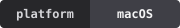
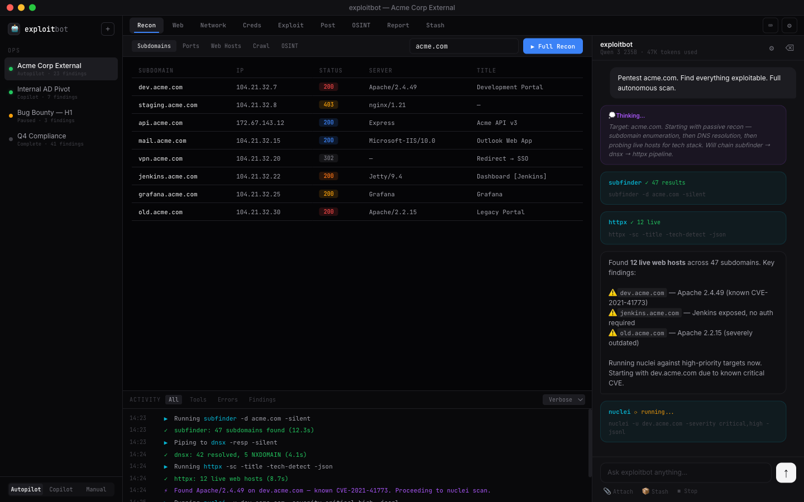
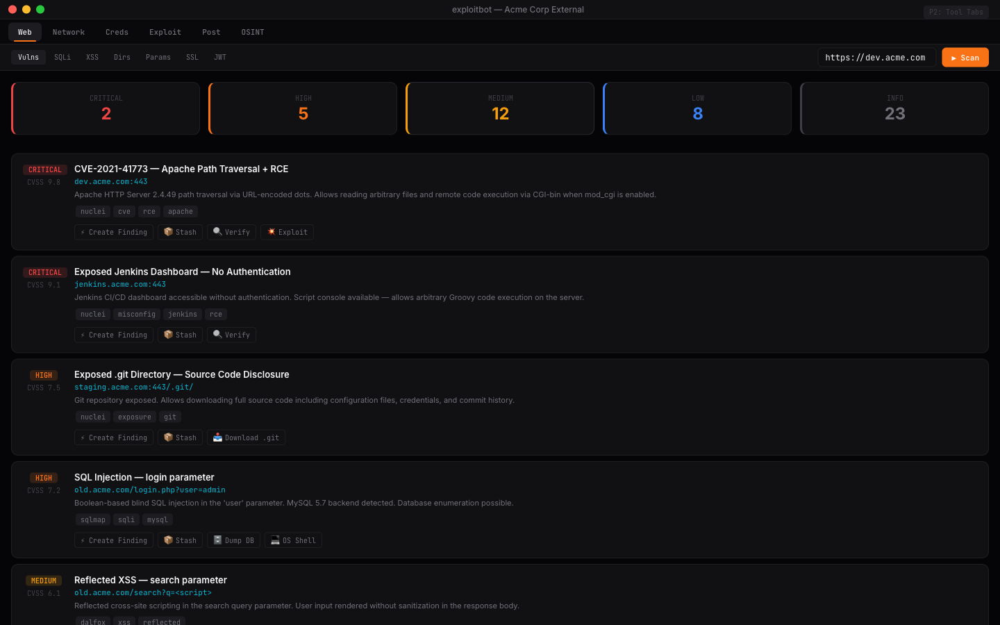
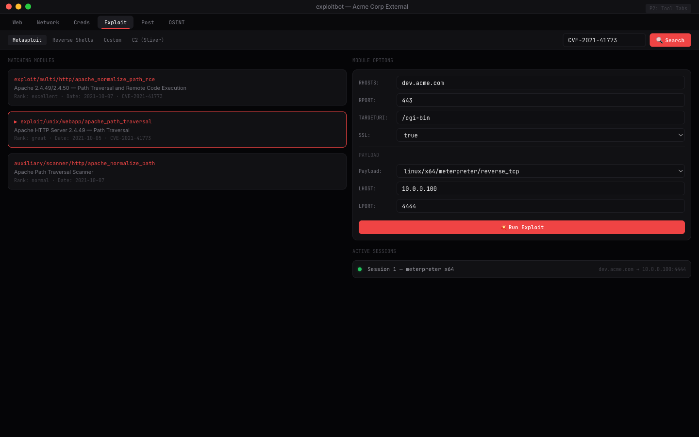
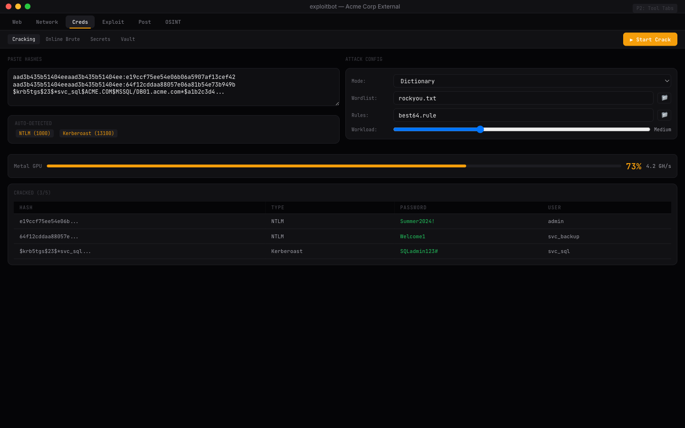
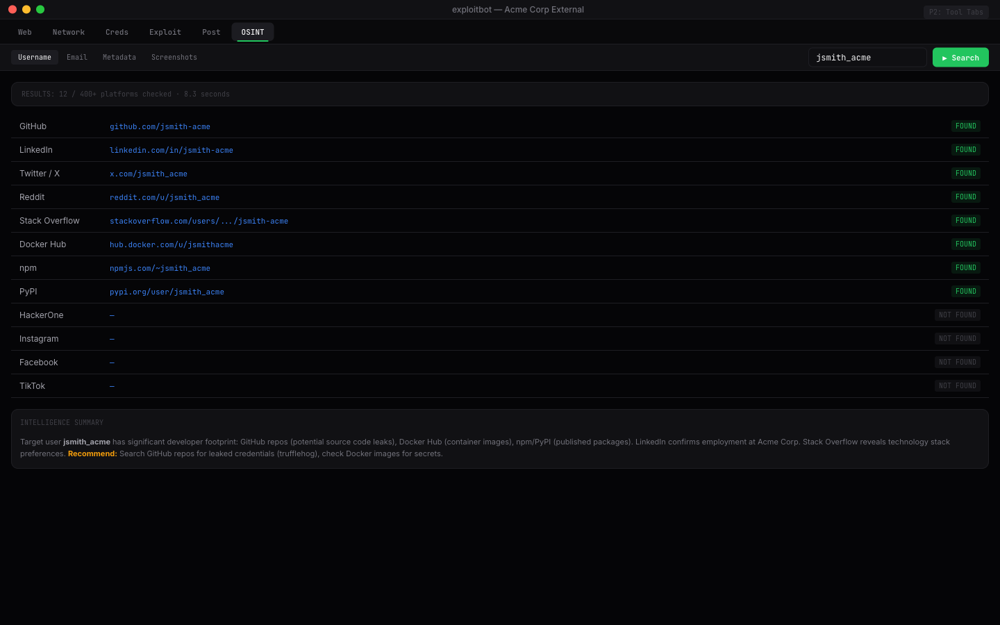

<p align="center">
  
</p>

<h1 align="center">exploit<sub style="font-weight:300">bot</sub></h1>

<p align="center">
  <strong>Autonomous pentesting on Apple Silicon</strong>
</p>

<p align="center">
  
  
  
  
</p>

<p align="center">
  <a href="https://github.com/jjang-ai/exploitbot/releases/download/v0.1.0-beta/ExploitBot-beta.dmg">
    
  </a>
</p>

<p align="center">
  <a href="https://exploit.bot">Website</a> •
  <a href="#features">Features</a> •
  <a href="#install">Install</a> •
  <a href="#models">Models</a> •
  <a href="#tools">Tools</a>
</p>

---

AI-powered penetration testing toolkit with local LLM inference. No cloud dependency, runs entirely on Apple Silicon.

exploitbot runs local models on Apple Silicon via [MLX](https://github.com/ml-explore/mlx), integrates real pentesting tools, and generates professional pentest reports from findings.

<p align="center">
  
</p>

## Features

**Local AI Inference** — vMLX-based models run on-device via Apple Silicon, with no API keys required.

**Ops System** — Named persistent workspaces for each engagement. Switch between targets without losing context. The LLM remembers evidence and findings across tabs.

**3 Interaction Modes**
- **Autopilot** — Give a target, watch it work. Full autonomous recon → exploitation → reporting.
- **Copilot** — AI suggests tools, you approve. Each action explained with risk level.
- **Manual** — You drive, AI advises. Full tool controls with chat-based guidance.

**42 integrated tool schemas** — from recon and web to exploit, OSINT, report, and supply-chain workflows. Callback tools (`search_cve`, `lookup_cve`, `search_context`) and `run_shell` are part of the same tool surface so you can mix operator-invoked and context tools per tab.

**Stash** — Cross-op artifact sharing. Drop credentials, hosts, payloads from any engagement, pull them into any other.

**Findings → Reports** — The endgame. Confirmed vulnerabilities auto-capture attack chains, evidence, and impact. Generate professional pentest reports in PDF, Markdown, HTML, or JSON.

**CVE Knowledge Base + Import** — Local CVE database with semantic search plus list import support (CSV/JSON) and include filters.

**Supply-Chain + CVE Ops** — Supply-chain discovery and CVE lifecycle workflows now include `trufflehog`, `syft`, `grype`, and `osv_scanner` action coverage in the same tool/agent state system as other recon modules.

**5 Languages** — Full interface and report generation in English, 한국어, 中文, Español, 日本語.

**Live Tool Telemetry** — Tool execution status updates are emitted per button/tab (queued, running, done, error), written to logs, and tracked in chat/panel history with CVE and stash workflow visibility.

## Beta Release Status (June 3, 2026)

The current beta DMG is published as a GitHub prerelease:

- Release: [ExploitBot 0.1.0 Beta](https://github.com/jjang-ai/exploitbot/releases/tag/v0.1.0-beta)
- Download: [ExploitBot-beta.dmg](https://github.com/jjang-ai/exploitbot/releases/download/v0.1.0-beta/ExploitBot-beta.dmg)
- DMG SHA256: `647bfa9e662c21e37b0cb79473fcf415a6ce058c15097c321dfa23440660175e`
- Signing: Developer ID Application, hardened runtime
- Notarization: app and DMG submitted, stapled, and validated

### Done in the current beta lane

- **Autonomous agent loop**: deployed agents run in autopilot mode, inherit model/settings state, expose live tool status, and can request the full registered tool schema set instead of only the active tab subset.
- **Broad tool surface**: the in-app model tool catalogue covers recon, web, network, credentials, exploit, post-exploit, OSINT, supply-chain, CVE, context, and shell execution.
- **Supply-chain + CVE workflow**: first-class supply-chain tab, CVE search/import actions, SBOM/dependency/secrets actions, CLI routing, installer taxonomy, and per-action status state are wired.
- **CVE import/include + embeddings gate**: `/qa/cve-import-embedding-coverage` proves CVE list import with an `includeOnly` CVE-ID allowlist, selected/excluded import audit state, semantic CVE embedding search, on-demand CVE/context retrieval, and the bounded prompt-injection policy.
- **Shell tool safety**: `run_shell` remains visible to the agent/tool catalogue, but destructive command samples are blocked through an auditable pattern policy covered by registry and QA proofs.
- **Runtime packaging path**: release packaging bundles the vMLX Python engine, selects a valid bundled/runtime interpreter, verifies required modules, signs the app/DMG, and records manifest evidence.
- **Qwen + MiniMax cache proofs**: live/release harnesses cover Qwen MXFP4-MTP hybrid SSM attention, MiniMax full-KV attention, TurboQuant KV cache, prefix cache, paged/block L2 cache, and repeat-prompt cache hits.
- **Local low-RAM Qwen lane**: `/qa/runtime-local-model-lane` pins the active small local Qwen beta target to `/Users/eric/models/JANGQ/Qwen3.6-27B-MXFP4-MTP`, verifies the release-app live chat/cache artifact, enforces a sub-20 GB active-memory ceiling for the Qwen smoke and batching artifacts, and keeps active beta families to Qwen/MiniMax only.
- **Parallel/session + batching gates**: `scripts/parallel-agent-session-proof.py` drives two autonomous agents against a delayed mock Qwen engine and proves overlapping app requests (`max_in_flight=2`) plus live `workingCount`/status-line state; `/qa/continuous-batching-coverage` source-checks the vMLX server, launcher `--max-num-seqs` path, BatchedEngine, LLM scheduler, MLLM scheduler, MLLM batch generator, BatchKV/BatchMamba cache, TurboQuant KV, L2 disk cache, and hybrid SSM companion contracts.
- **Qwen live continuous batching**: `scripts/prove-live-continuous-batching.py` live-loads `/Users/eric/models/JANGQ/Qwen3.6-27B-MXFP4-MTP` with `--max-num-seqs 2`, sends two concurrent chat completions, and records `max_running_observed=2`, `max_waiting_observed=2`, `num_requests_processed=2`, TurboQuant q4 KV, block L2 disk writes, and SSM companion async rederive completion in `docs/live-proofs/checkpoint-452-qwen-continuous-batching-live.json`.
- **MiniMax live batching readiness gate**: `/qa/continuous-batching-coverage` now exposes the required MiniMax low-RAM batching artifact path, live-ready flag, and exact command (`python3 scripts/prove-live-minimax-continuous-batching.py`) instead of leaving the MiniMax stress gap implicit.
- **Startup cache/defaults gate**: `/qa/startup-cache-defaults` proves the app starts from required parser/cache defaults, Settings apply re-forces them, engine launch paths carry parser, TurboQuant, prefix/L2/paged/block cache, and `--max-num-seqs` flags, and settings/runtime coverage mirror the same contract.
- **Context budget + compaction gate**: `/qa/context-budget-compaction` proves bounded automatic context injection, single-line catalog snippet compaction, max-token/max-iteration forwarding, cache-preserving new-context behavior, and on-demand stash/CVE retrieval under the prompt-injection policy `search-on-demand-not-force-injected`.
- **Prompt-injection boundary gate**: `/qa/context-prompt-injection-boundary` proves context is bounded/on-demand instead of broad prompt stuffing, callback CVE/context tools stay available, per-turn tool schemas are capped, full agent tool schemas remain separate, `run_shell` is visible but blocklisted for destructive samples, and streaming/Responses reuse surfaces are isolated.
- **Streaming/parser + Responses reuse gate**: `/qa/streaming-parser-reuse` source-checks Chat Completions SSE deltas, ChatService content/reasoning/tool-call delta handling, streamed usage with cached-token telemetry, `/v1/responses` streaming events, `previous_response_id` session reuse, and Qwen/MiniMax streaming tool parser coverage. This is source/API-contract-backed; live model chat proof remains in the existing Qwen/MiniMax live artifacts.
- **Session/context/cache lifecycle gate**: `/qa/session-context-cache-flow` ties new-context cache preservation, bounded context carry, stash/CVE on-demand retrieval, Responses `previous_response_id` reuse, streaming delta parser surfaces, parallel agent sessions, Qwen live continuous batching, TurboQuant KV, L2/block disk cache, and hybrid SSM async rederive into one app-backed matrix.
- **Cache artifact matrix**: `/qa/cache-artifact-matrix` reads live proof JSON and exposes row-level counters for Qwen cross-restart scheduler/block/SSM disk hits, scheduler tokens saved, block-L2 store/read hits, TurboQuant q4 KV, Qwen continuous-batching block writes and SSM async rederive, plus MiniMax q4 KV and block-L2 writes.
- **Objective runtime coverage map**: `/qa/objective-runtime-coverage` rolls tool flow, runtime, local model lanes, context/compaction, prompt-injection boundaries, CVE import/embeddings, stash retrieval, parallel sessions, Responses/streaming parser reuse, L2 cache, TurboQuant KV, hybrid SSM async rederive, proof ledgers, and release readiness into one auditable map. It intentionally reports `objectiveComplete=false` while known gaps remain, with zero blocked objective requirements at this checkpoint.
- **Settings and persistence**: parser, generation, reasoning, engine cache, KV quantization, model path, session, terminal/tool path, and result-store state have QA proof coverage.
- **UI status coverage**: chat, sidebar, active agent lists, supply-chain actions, CVE import/search, terminal path state, and visual proof screenshots have checkpoint coverage.
- **Deep runtime/tool-flow gate**: `/qa/deep-runtime-flow-coverage` now rolls up tool flow, agent phases, local model lane selection, session/context/cache lifecycle, prompt-injection boundaries, bounded context, CVE taxonomy/import, semantic CVE embeddings, stash retrieval, parser matrix, Responses/SSE streaming delta handling, session workflows, and Qwen/MiniMax cache contracts into one app-backed beta gate.
- **Website refresh**: `exploit.bot` now points at the notarized beta DMG, uses the current dark app theme, preserves the logo treatment, includes cleaned current screenshot/proof assets, and has desktop/mobile browser verification across EN/KO/ZH/ES/JA.
- **Website SEO/i18n**: the live site has current Open Graph/Twitter metadata, favicon/manifest assets, sitemap image entries, `llms.txt`, `llms-full.txt`, `security.txt`, localized visible copy, localized page title/description updates, and live Playwright coverage for missing i18n keys, broken images, and mobile overflow.

### Needs more work before public beta

- **Qwen multimodal promotion**: Qwen-specific VL/multimodal runtime, multimodal prefix cache, and multimodal context-routing proofs are still pending.
- **General chat quality**: broad reasoning/tool-call quality beyond bounded smoke prompts still needs longer realistic runs, especially MiniMax first-turn instruction-following.
- **Full app UI pass**: source/API/proof coverage is broad and the website has been visually reviewed, but the native app still needs a final hands-on visual pass across every tab, status indicator, hover/detail state, and release build window before calling it polished.
- **MiniMax live batching stress**: Qwen live multi-request batching is proven, and MiniMax now has a required readiness gate, but `docs/live-proofs/checkpoint-464-minimax-continuous-batching-live.json` still needs to be generated on a quiet machine with enough free RAM.
- **Security review**: supply-chain/pentest features are wired, but the release still needs a deliberate abuse-boundary, logging, and command-safety review before wider distribution.

## Screenshots

<table>
  <tr>
    <td></td>
    <td></td>
  </tr>
  <tr>
    <td><em>Web vulnerability scanner with CVSS cards</em></td>
    <td><em>Metasploit module browser + payload config</em></td>
  </tr>
  <tr>
    <td></td>
    <td></td>
  </tr>
  <tr>
    <td><em>GPU-accelerated hash cracking via Metal</em></td>
    <td><em>Username OSINT across 400+ platforms</em></td>
  </tr>
</table>

<a name="install"></a>
## Install

### Download

Download the beta DMG from [Releases](https://github.com/jjang-ai/exploitbot/releases/tag/v0.1.0-beta). Release builds should be signed, notarized, stapled, and verified before publishing.

Requires **macOS 14+** and **Apple Silicon** (M1/M2/M3/M4).

### Build from Source

```bash
git clone https://github.com/jjang-ai/exploitbot.git
cd exploitbot

# Build and run local verification app
./script/build_and_run.sh --verify

# Package unsigned DMG for beta distribution
./script/package_release.sh --skip-notarize

# Notarized DMG using a keychain profile
EXPLOITBOT_NOTARY_PROFILE=<profile> ./script/package_release.sh --notarize

# Notarized DMG using local notary environment variables
set +x
source /path/to/private/.env.signing
./script/package_release.sh --notarize
```

**Prerequisites:**
- macOS 14+ on Apple Silicon
- Xcode 16+ (Swift toolchain)
- A vMLX-compatible model running on localhost:8000 (see [vMLX](https://github.com/jjang-ai/vmlx))
- Pentesting tools installed via homebrew/pip for tool execution

<a name="models"></a>
## Models

exploitbot is model-folder driven and currently supports:

- **Qwen text** (`qwen`) with the active beta proof lane on MXFP4-MTP folders.
- **MiniMax text** (`minimax`) with MiniMax JANG_K metadata proof and Small JANGTQ low-RAM load/cache proof.

Use local folders from:

```bash
export EXPLOITBOT_MODELS=/Users/eric/models
export EXPLOITBOT_RELEASE_QWEN_MODEL=${EXPLOITBOT_MODELS}/JANGQ/Qwen3.6-27B-MXFP4-MTP

# Smallest local Qwen smoke target (lower RAM)
${EXPLOITBOT_MODELS}/JANGQ/Qwen3.6-27B-MXFP4-MTP

# Larger MXFP4 variant
${EXPLOITBOT_MODELS}/JANGQ/Qwen3.6-35B-A3B-MXFP4-MTP

# MiniMax low-RAM proof target and full JANG metadata target
${EXPLOITBOT_MODELS}/JANGQ/MiniMax-M2.7-Small-JANGTQ
${EXPLOITBOT_MODELS}/dealign.ai/MiniMax-M2.7-JANG_K-CRACK
```

For runtime checks, start with the smallest Qwen target first to keep RAM pressure low.
The command examples below also default to this model.

<a name="tools"></a>
## Tools

42 tool definitions across 8 operational areas:

| Category | Tools |
|----------|-------|
| **Recon** | subfinder, dnsx, nmap, masscan, httpx, katana, theharvester |
| **Web** | nuclei, sqlmap, dalfox, feroxbuster, ffuf, arjun, wpscan, testssl, graphqlmap, jwt_tool |
| **Network** | netexec, snmpwalk, tshark, bettercap, chisel |
| **Credentials** | hashcat, hydra, haiti, trufflehog |
| **Exploit** | metasploit, pwncat, sliver |
| **Post-Exploit** | linpeas, impacket |
| **OSINT** | sherlock, holehe, exiftool, gowitness |
| **Supply-Chain** | trufflehog, syft, grype, osv_scanner |
| **General / Report / Stash** | search_cve (local CVE DB), lookup_cve, search_context, run_shell |

Lightweight tools are bundled in the app. Heavy tools are installed on first use via homebrew/pip.

## Architecture

- **UI:** SwiftUI (native macOS 14+)
- **Inference:** vMLX engine (MLX on Apple Silicon) — localhost server, OpenAI-compatible API
- **IPC:** HTTP + SSE streaming to local vMLX server
- **Persistence:** SQLite (GRDB.swift) with WAL mode
- **Terminal:** SwiftTerm (embedded pty)
- **Reports:** HTML → PDF via WKWebView
- **CVE DB:** SQLite + sqlite-vec (semantic search with nomic-embed-text)
- **Packaging:** Hardened runtime, app + DMG signing, app + DMG notarization/stapling, and release manifest hashes

## Documentation

- [Design Document](docs/plans/2026-03-23-exploitbot-design.md) — Product and UX design
- [Technical Specification](docs/plans/2026-03-23-technical-spec.md) — 29 technical decisions with rationale
- [Feature Matrix](docs/plans/2026-03-23-exhaustive-feature-matrix.md) — 1,307 checkable items for QA
- [Tool Definitions](ExploitBot/Sources/ExploitBot/Services/ToolDefinitions.swift) — 42 tool schemas in-app
- [Tool Registry](ExploitBotEngine/tools/registry.json) — external CLI mappings for supported binaries (39 entries)
- [System Prompts](ExploitBotEngine/prompts/) — Base + per-tab LLM instruction templates
- [Beta Release and Website Ops](docs/beta-release-and-website-ops.md) — safe release, notarization, verification, and website update checklist

### Runtime Verification

- `swift build --package-path ExploitBot -c debug`
- `python3 scripts/release-readiness-proof.py`
- `python3 scripts/verify-live-models.py --qwen ${EXPLOITBOT_MODELS}/JANGQ/Qwen3.6-27B-MXFP4-MTP --metadata-only`
- `python3 scripts/verify-live-models.py --qwen ${EXPLOITBOT_RELEASE_QWEN_MODEL} --restart-replay --require-ssm-companion-hit`
- `python3 scripts/release-app-live-qwen-proof.py`
- `EXPLOITBOT_RELEASE_QWEN_MODEL=${EXPLOITBOT_RELEASE_QWEN_MODEL} python3 scripts/release-app-qwen-cross-restart-cache-proof.py`
- `EXPLOITBOT_LIVE_BATCH_QWEN_MODEL=${EXPLOITBOT_MODELS}/JANGQ/Qwen3.6-27B-MXFP4-MTP python3 scripts/prove-live-continuous-batching.py`
- `EXPLOITBOT_LIVE_BATCH_MINIMAX_MODEL=${EXPLOITBOT_MODELS}/JANGQ/MiniMax-M2.7-Small-JANGTQ python3 scripts/prove-live-minimax-continuous-batching.py`
- `python3 scripts/minimax-continuous-batching-readiness-proof.py`
- `python3 scripts/startup-cache-defaults-proof.py`
- `python3 scripts/verify-live-models.py --minimax ${EXPLOITBOT_MODELS}/dealign.ai/MiniMax-M2.7-JANG_K-CRACK --metadata-only`
- `python3 scripts/release-app-live-minimax-proof.py`
- `python3 scripts/agent-live-tool-status-proof.py`
- `python3 scripts/context-budget-compaction-proof.py`
- `python3 scripts/session-context-cache-flow-proof.py`
- `python3 scripts/cache-artifact-matrix-proof.py`
- `python3 scripts/objective-runtime-coverage-proof.py`
- `python3 scripts/supply-chain-cve-ui-proof.py`
- `python3 scripts/cve-settings-actions-proof.py`
- `python3 scripts/terminal-tool-paths-proof.py`
- `python3 scripts/tool-flow-coverage-proof.py`

## License

Open source. License TBD.

## Disclaimer

exploitbot is designed for authorized security testing, penetration testing engagements, CTF competitions, and security research. Always obtain proper authorization before testing any system you do not own. The developers are not responsible for misuse.

---

<p align="center">
  <a href="https://exploit.bot">exploit.bot</a> · Powered by vMLX engine · Built for Apple Silicon
</p>
